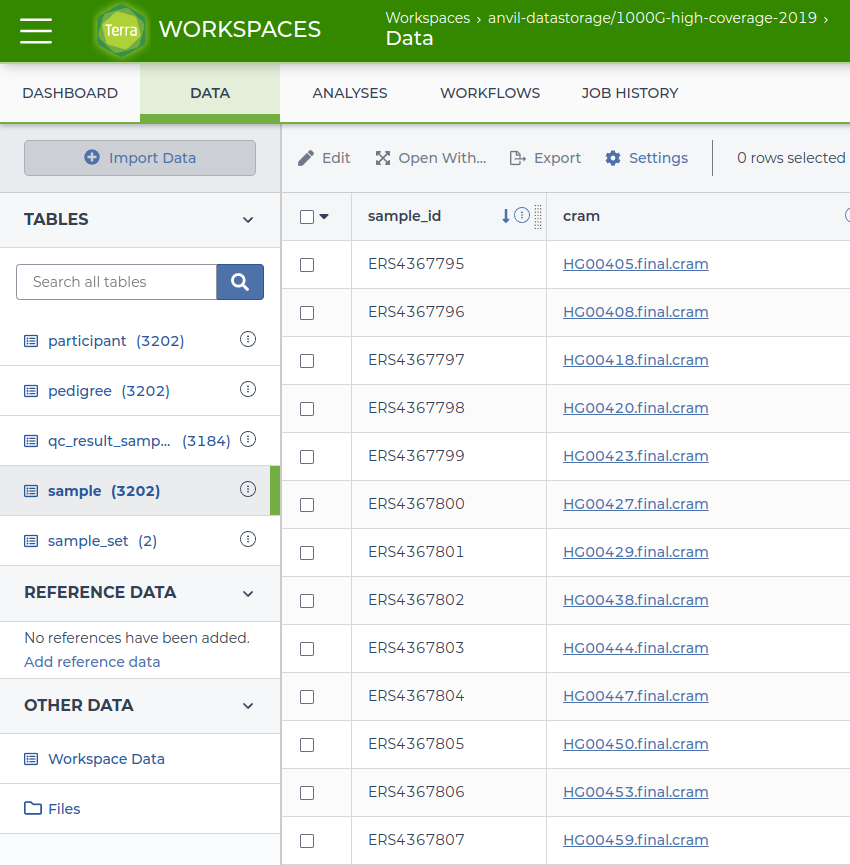

```{r setup, include=FALSE}
has_gcloud <- AnVILBase::has_avworkspace(
    strict = TRUE, platform = AnVILGCP::gcp()
)
knitr::opts_chunk$set(
    eval = has_gcloud, collapse = TRUE, cache = TRUE
)
options(width = 75)
```

# Installation

Install the `AnVILGCP` package from Bioconductor with:

```{r, eval = FALSE}
if (!requireNamespace("BiocManager", quietly = TRUE))
    install.packages("BiocManager")

BiocManager::install("AnVILGCP")
```

Once installed, load the package with

```{r, message =FALSE, eval = TRUE, cache = FALSE}
library(AnVILGCP)
```

## Additional Setup

For reproducibility, it is advisable to install packages into libraries on a
project-specific basis, e.g., to create a 'snapshot' of packages for
reproducible analysis. Use

```{r, eval = FALSE}
add_libpaths("~/my/project")
```

as a convenient way to prepend a project-specific library path to
`.libPaths()`. New packages will be installed into this library.

## Use in the AnVIL cloud

In the AnVIL cloud environment, clone or create a new workspace. Click
on the `Cloud Environment` button at the top right of the
screen. Choose the `R / Bioconductor` runtime to use in a Jupyter
notebook, or `RStudio` to use in RStudio. When creating a Jupyter
notebook, choose `R` as the engine.

A new layout is being introduced in Fall of 2022. If the workspace has
an 'Analyses' tab, navigate to it and look for the 'Environment
Configuration' button to the right of the screen. For a Jupyter
notebook-based environment, select `jupyter` 'Environment Settings'
followed by `Customize` and the `R / Bioconductor` application
configuration. _RStudio_ is available by clicking on the `RStudio /
Bioconductor` 'Environment Settings' button.

For tasks more complicated than manipulation and visualization of
tabular data (e.g., performing steps of a single-cell work flow) the
default Jupyter notebook configuration of 1 CPU and 3.75 GB of memory
will be insufficient; the RStudio image defaults to 4 CPU and 15 GB of
memory.

## Local use

Local use requires that the gcloud SDK is installed, and that the
billing account used by AnVIL can be authenticated with the
user. These requirements are satisfied when using the AnVIL compute
cloud. For local use, one must

- [Install][install-gcloud-sdk] the gcloud sdk (for Linux and Windows,
  `cloudml::gcloud_install()` provides an alternative way to install
  gcloud).
- Define an environment variable or `option()` named `GCLOUD_SDK_PATH`
  pointing to the root of the SDK installation, e.g,

    ```{r, eval = FALSE}
    dir(file.path(Sys.getenv("GCLOUD_SDK_PATH"), "bin"), "^(gcloud|gsutil)$")
    ## [1] "gcloud" "gsutil"
    ```

  Test the installation with `gcloud_exists()`

    ```{r, eval = TRUE}
    ## the code chunks in this vignette are fully evaluated when
    ## gcloud_exists() returns TRUE
    gcloud_exists()
    ```

## Graphical interfaces

Several commonly used functions have an additional 'gadget' interface,
allowing selection of workspaces (`avworkspace_gadget()`, DATA tables
(`avtable_gadget()`) and workflows `avworkflow_gadget()` using a
simple tabular graphical user interface. The `browse_workspace()`
function allows selection of a workspace to be opened as a browser
tab.

## Working with Google cloud-based resources

The AnVIL package implements functions to facilitate access to Google
cloud resources.

### Using `gcloud_*()` for account management {.unnumbered}

The `gcloud_*()` family of functions provide access to Google cloud
functions implemented by the `gcloud` binary. `gcloud_project()`
returns the current billing account.

```{r, eval=has_gcloud}
gcloud_account() # authentication account
gcloud_project() # billing project information
```

A convenient way to access _any_ `gcloud` SDK command is to use
`gcloud_cmd()`, e.g.,

```{r, eval = FALSE}
gcloud_cmd("projects", "list") |>
    readr::read_table() |>
    filter(startsWith(PROJECT_ID, "anvil"))
```

This translates into the command line `gcloud projects list`. Help is
also available within _R_, e.g.,

```{r, eval = FALSE}
gcloud_help("projects")
```

Use `gcloud_help()` (with no arguments) for an overview of available
commands.

### Using `gsutil_*()` for file and bucket management {.unnumbered}

The `gsutil_*()` family of functions provides an interface to google
bucket manipulation. The following refers to publicly available 1000
genomes data available in Google Cloud Storage.

```{r, eval=has_gcloud}
src <- "gs://genomics-public-data/1000-genomes/"
```

`gsutil_ls()` lists bucket content; `gsutil_stat()` additional detail
about fully-specified buckets.

```{r, eval=has_gcloud}
avlist(src)

other <- paste0(src, "other")
avlist(other, recursive = TRUE)

sample_info <- paste0(src, "other/sample_info/sample_info.csv")
gsutil_stat(sample_info)
```

`gsutil_cp()` copies buckets from or to Google cloud storage; copying
to cloud storage requires write permission, of course. One or both of
the arguments can be cloud endpoints.

```{r, eval=has_gcloud}
fl <- tempfile()
avcopy(sample_info, fl)

csv <- readr::read_csv(fl, guess_max = 5000L, col_types = readr::cols())
csv
```

`gsutil_pipe()` provides a streaming interface that does not require
intermediate disk storage.

```{r, eval=has_gcloud}
pipe <- gsutil_pipe(fl, "rb")
readr::read_csv(pipe, guess_max = 5000L, col_types = readr::cols()) |>
    dplyr::select("Sample", "Family_ID", "Population", "Gender")
```

`gsutil_rsync()` synchronizes a local file hierarchy with a remote
bucket. This can be a powerful operation when `delete = TRUE`
(removing local or remote files), and has default option `dry = TRUE`
to indicate the consequences of the sync.

```{r, eval=has_gcloud}
destination <- tempfile()
stopifnot(dir.create(destination))
source <- paste0(src, "other/sample_info")

## dry run
gsutil_rsync(source, destination)

gsutil_rsync(source, destination, dry = FALSE)
dir(destination, recursive = TRUE)

## nothing to synchronize
gsutil_rsync(source, destination, dry = FALSE)

## one file requires synchronization
unlink(file.path(destination, "README"))
gsutil_rsync(source, destination, dry = FALSE)
```

`localize()` and `delocalize()` provide 'one-way'
synchronization. `localize()` moves the content of the `gs://`
`source` to the local file system. `localize()` could be used at the
start of an analysis to retrieve data stored in the google cloud to
the local compute instance. `delocalize()` performs the complementary
operation, copying local files to a `gs://` destination. The `unlink =
TRUE` option to `delocalize()` unlinks local `source` files
recursively. It could be used at the end of an analysis to move
results to the cloud for long-term persistent storage.

## Using `av*()` to work with AnVIL tables and data

### Tables, reference data, and persistent files {.unnumbered}

AnVIL organizes data and analysis environments into
'workspaces'. AnVIL-provided data resources in a workspace are managed
under the 'DATA' tab as 'TABLES', 'REFERENCE DATA', and 'OTHER DATA';
the latter includes ''Workspace Data' and 'Files', with 'Files'
corresponding to a Google Cloud Bucket associated with the
workspace. These components of the graphical user interface are
illustrated in the figure below.

```{r, echo = FALSE, cache = FALSE}

```

The AnVIL package provides programmatic tools to access different
components of the data workspace, as summarized in the following
table.

Workspace      | AnVIL function
---------------|---------------
TABLES         | `avtables()`
REFERENCE DATA | None
OTHER DATA     | `avstorage()`
Workspace Data | `avdata()`
Files          | `avlist()`, `avbackup()`, `avrestore()`

```{r, include=FALSE, cache=FALSE, eval=has_gcloud}
avworkspace_namespace("pathogen-genomic-surveillance")
avworkspace_name("COVID-19")
```

Data tables in a workspace are available by specifying the `namespace`
(billing account) and `name` (workspace name) of the workspace. When
on the AnVIL in a Jupyter notebook or RStudio, this information can be
discovered with

```{r, eval=has_gcloud}
avworkspace_namespace()
avworkspace_name()
```

It is also possible to specify, when not in the AnVIL compute
environment, the data resource to work with.

```{r, eval=FALSE}
## N.B.: IT MAY NOT BE NECESSARY TO SET THESE WHEN ON ANVIL
avworkspace_namespace("pathogen-genomic-surveillance")
avworkspace_name("COVID-19")
```

### Using `avtable*()` for accessing tables {.unnumbered}

Accessing data tables use the `av*()` functions. Use `avtables()` to
discover available tables, and `avtable()` to retrieve a particular
table

```{r, eval=has_gcloud}
avtables()
sample <- avtable("sample_set")
sample
```

The data in the table can then be manipulated using standard _R_
commands, e.g., to identify SRA samples for which a final assembly
fasta file is available.

```{r, eval=has_gcloud}
sample |>
    dplyr::select("sample_set_id", contains("fasta")) |>
    dplyr::filter(!is.na("Successful_Assembly_group"))
```

Users can easily add tables to their own workspace using
`avtable_import()`, perhaps as the final stage of a pipe

```{r, eval = FALSE}
my_cars <-
    mtcars |>
    as_tibble(rownames = "model") |>
    mutate(model = gsub(" ", "_", model))
job_status <- avtable_import(my_cars)
```

Tables are imported 'asynchronously', and large tables (more than 1.5
million elements; see the `pageSize` argument) are uploaded in
pages. The `job status` is a tibble summarizing each page; the status
of the upload can be checked with

```{r, eval = FALSE}
avtable_import_status(job_status)
```

The transcript of a session where page size is set intentionally small
for illustration is

```{r, eval = FALSE}
(job_status <- avtable_import(my_cars, pageSize = 10))
## pageSize = 10 rows (4 pages)
##   |======================================================================| 100%
## # A tibble: 4 × 5
##    page from_row to_row job_id                               status
##   <int>    <int>  <int> <chr>                                <chr>
## 1     1        1     10 a32e9706-f63c-49ed-9620-b214746b9392 Uploaded
## 2     2       11     20 f2910ac2-0954-4fb9-b36c-970845a266b7 Uploaded
## 3     3       21     30 e18adc5b-d26f-4a8a-a0d7-a232e17ac8d2 Uploaded
## 4     4       31     32 d14efb89-e2dd-4937-b80a-169520b5f563 Uploaded
(job_status <- avtable_import_status(job_status))
## checking status of 4 avtable import jobs
##   |======================================================================| 100%
## # A tibble: 4 × 5
##    page from_row to_row job_id                               status
##   <int>    <int>  <int> <chr>                                <chr>
## 1     1        1     10 a32e9706-f63c-49ed-9620-b214746b9392 Done
## 2     2       11     20 f2910ac2-0954-4fb9-b36c-970845a266b7 Done
## 3     3       21     30 e18adc5b-d26f-4a8a-a0d7-a232e17ac8d2 ReadyForUpsert
## 4     4       31     32 d14efb89-e2dd-4937-b80a-169520b5f563 ReadyForUpsert
(job_status <- avtable_import_status(job_status))
## checking status of 4 avtable import jobs
##   |======================================================================| 100%
## # A tibble: 4 × 5
##    page from_row to_row job_id                               status
##   <int>    <int>  <int> <chr>                                <chr>
## 1     1        1     10 a32e9706-f63c-49ed-9620-b214746b9392 Done
## 2     2       11     20 f2910ac2-0954-4fb9-b36c-970845a266b7 Done
## 3     3       21     30 e18adc5b-d26f-4a8a-a0d7-a232e17ac8d2 Done
## 4     4       31     32 d14efb89-e2dd-4937-b80a-169520b5f563 Done
```

The Terra data model allows for tables that represent samples of other
tables. The following create or add rows to `participant_set` and
`sample_set` tables. Each row represents a sample from the
corresponding 'origin' table.

```{r, eval = FALSE}
## editable copy of '1000G-high-coverage-2019' workspace
avworkspace("anvil-datastorage/1000G-high-coverage-2019")
sample <-
    avtable("sample") |>                               # existing table
    mutate(set = sample(head(LETTERS), nrow(.), TRUE))  # arbitrary groups
sample |>                                   # new 'participant_set' table
    avtable_import_set("participant", "set", "participant")
sample |>                                   # new 'sample_set' table
    avtable_import_set("sample", "set", "name")
```

The `TABLES` data in a workspace are usually provided as curated
results from AnVIL. Nonetheless, it can sometimes be useful to delete
individual rows from a table. Use `avtable_delete_values()`.

### Using `avdata()` for accessing Workspace Data {.unnumbered}

The 'Workspace Data' is accessible through `avdata()` (the example
below shows that some additional parsing may be necessary).

```{r, eval=has_gcloud}
avdata()
```

### Using `avstorage()` and  workspace files {.unnumbered}

Each workspace is associated with a google bucket, with the content
summarized in the 'Files' portion of the workspace. The location of
the files is

```{r, eval=has_gcloud}
bucket <- avstorage()
bucket
```

The content of the bucket can be viewed with (if permissions allow)

```{r, eval=FALSE}
avlist()
```

If the workspace is owned by the user, then persistent data can be
written to the bucket.

```{r, eval = FALSE}
## requires workspace ownership
uri <- avstorage()                             # discover bucket
bucket <- file.path(uri, "mtcars.tab")
write.table(mtcars, gsutil_pipe(bucket, "w")) # write to bucket
```

A particularly convenient operation is to back up files or directories
from the compute node to the bucket

```{r, eval = FALSE}
## backup all files and folders in the current working directory
avbackup(getwd(), recursive = TRUE)

## backup all files in the current directory
avbackup(dir())

## backup all files to gs://<avstorage()>/scratch/
avbackup(dir, paste0(avstorage(), "/scratch"))
```

Note that the backup operations have file naming behavior like the
Linux `cp` command; details are described in the help page
`gsutil_help("cp")`.

Use `avrestore()` to restore files or directories from the
workspace bucket to the compute node.

## Using `avnotebooks*()` for notebook management

Python (`.ipynb`) or R (`.Rmd`) notebooks are associated with
individual workspaces under the DATA tab, `Files/notebooks`
location.

Jupyter notebooks are exposed through the Terra interface under the
NOTEBOOKS tab, and are automatically synchronized between the
workspace and the current runtime.

R markdown documents may also be associated with the workspace (under
DATA `Files/notebooks`) but are not automatically synchronized with
the current runtime. The functions in this section help manage R
markdown documents.

Available notebooks in the workspace are listed with
`avnotebooks()`. Copies of the notebooks on the current runtime are
listed with `avnotebooks(local = TRUE)`. The default location of the
notebooks is `~/<avworkspace_name()>/notebooks/`.

Use `avnotebooks_localize()` to synchronize the version of the
notebooks in the workspace to the current runtime. This operation
might be used when a new runtime is created, and one wishes to start
with the notebooks found in the workspace. If a newer version of the
notebook exists in the workspace, this will overwrite the older
version on the runtime, potentially causing data loss. For this
reason, `avnotebooks_localize()` by default reports the actions that
will be performed, without actually performing them. Use
`avnotebooks_localize(dry = FALSE)` to perform the localization.

Use `avnotebooks_delocalize()` to synchronize local versions of the
notebooks on the current runtime to the workspace. This operation
might be used when developing a workspace, and wishing to update the
definitive notebook in the workspace. When `dry = FALSE`, this
operation also overwrites older workspace notebook files with their
runtime version.

## Using `avworkflows_*()` for workflows

See the vignette "Running an AnVIL workflow within R", in this
package, for details on running workflows and managing output.

## Using `avworkspace_*()` for workspaces

`avworkspace()` is used to define or return the 'namespace' (billing
project) and 'name' of the workspace on which operations are to
act. `avworkspace_namespace()` and `avworkspace_name()` can be used to
set individual elements of the workspace.

`avworkspace_clone()` clones a workspace to a new location. The clone
includes the 'DATA', 'NOTEBOOK', and 'WORKFLOWS' elements of the
workspace.

# Session Info

```{r, eval=TRUE}
sessionInfo()
```
